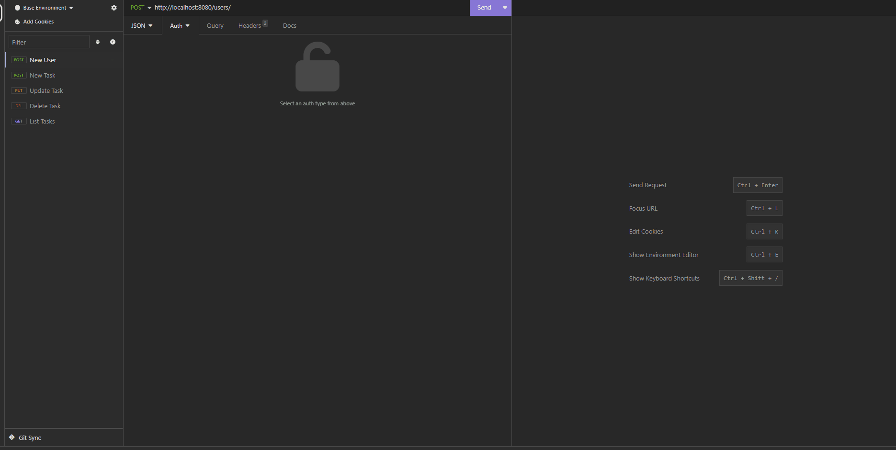

# ToDo List📃
Projeto em desenvolvimento no evento da Rocketseat🚀 , onde foi desenvolvido uma api de todo list utilizando o framework Spring Boot do Java☕;

Nesse api é possivel cadastrar um usuário, realizar operações de CRUD para uma nova tarefa com o usuário devidamente autenticado e salvar informações no banco H2;




## Tecnologias usadas ⚙
  - Java 17
  - Spring Boot
  - H2 Database
  - Bcrypt
  - Maven


## Atualizações 🔃
  - Operações CRUD para tarefas;
  - Autenticação do usuário;
  - Configuração do Docker para deploy;

## Como utilizar
- Clone o projeto do repositório
```
git clone https://github.com/RafaelMatos/todoSpring
```
- Acesse a pasta do projeto
```
cd todoSpring
```
- Realizar build da aplicação

## Rotas da aplicação
<a href="todoSpringRoutes.json">JSON</a>


